

  
  

# Koibanx Backend Challenge

Koibanx Backend Challenge

## Screenshots

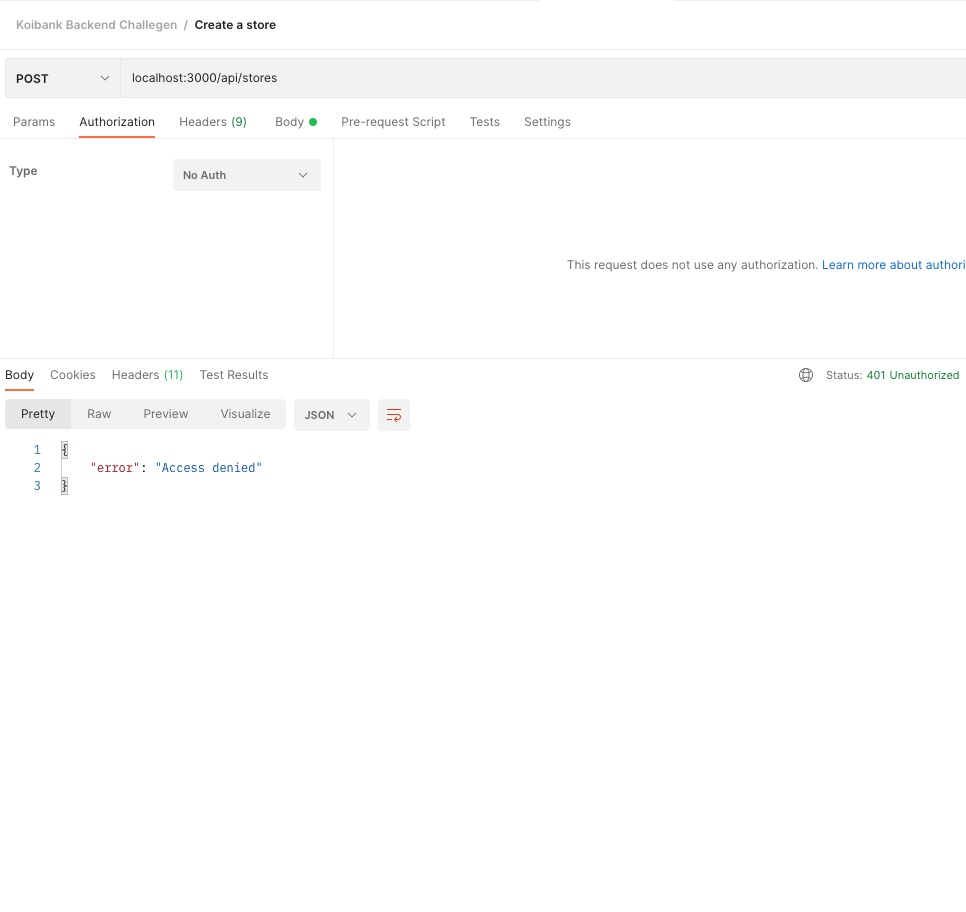   
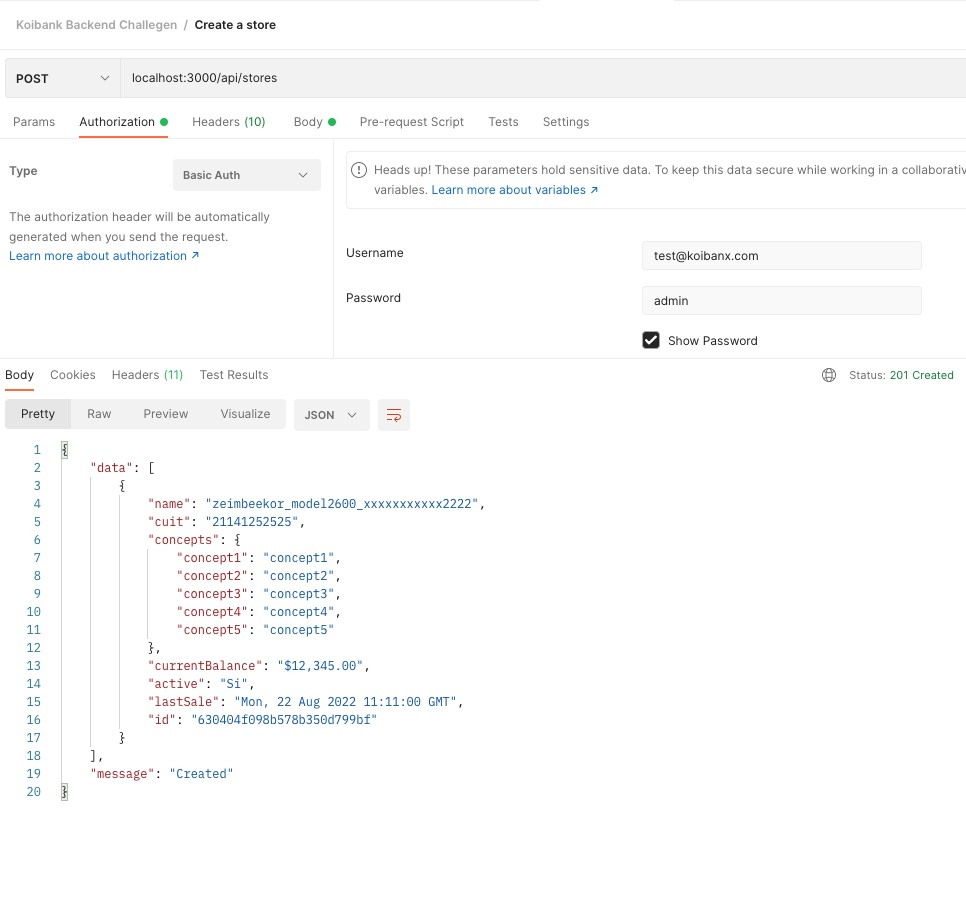   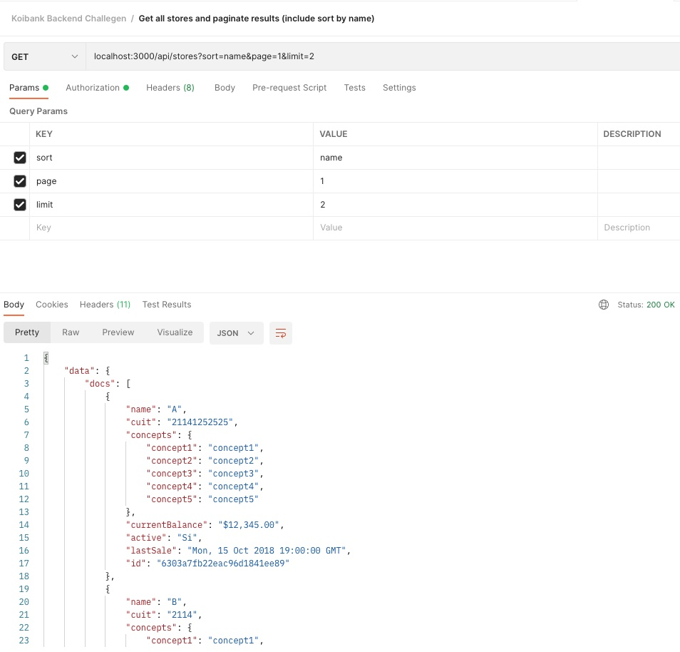
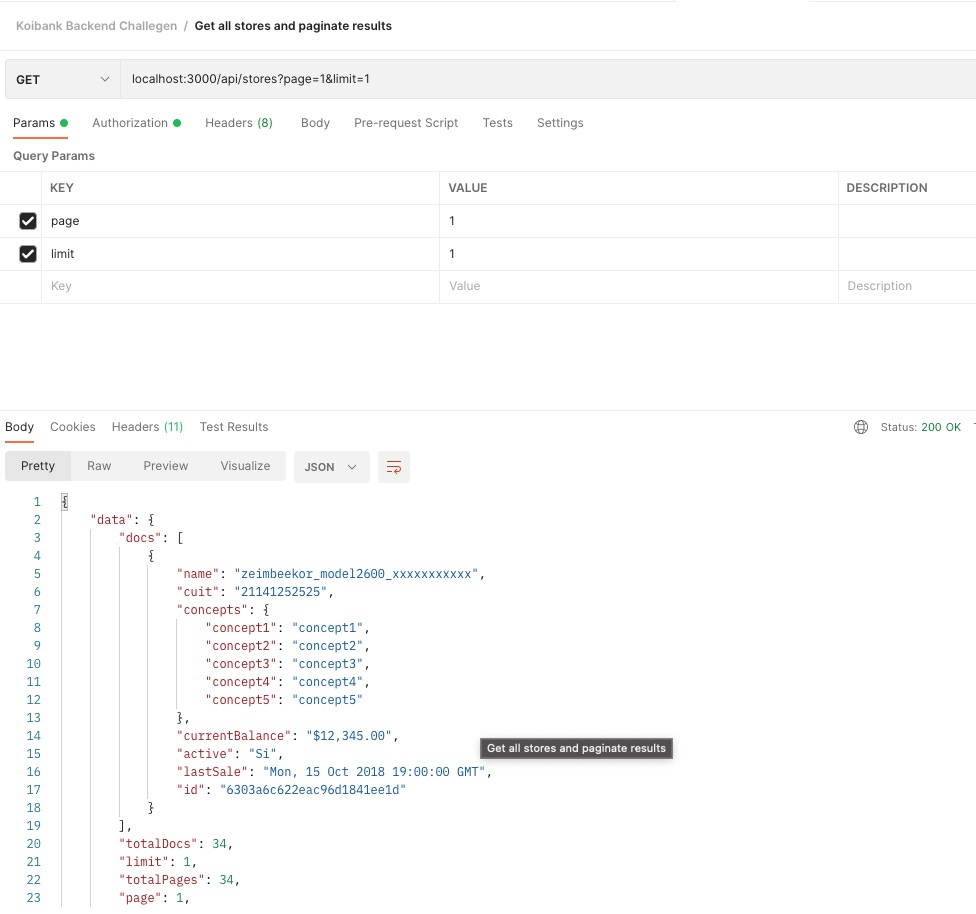   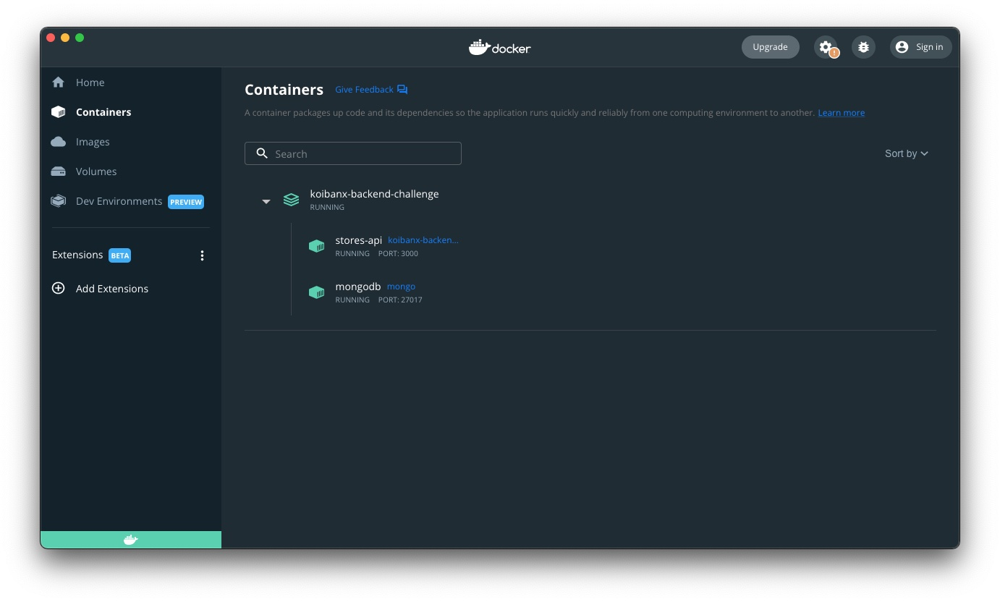
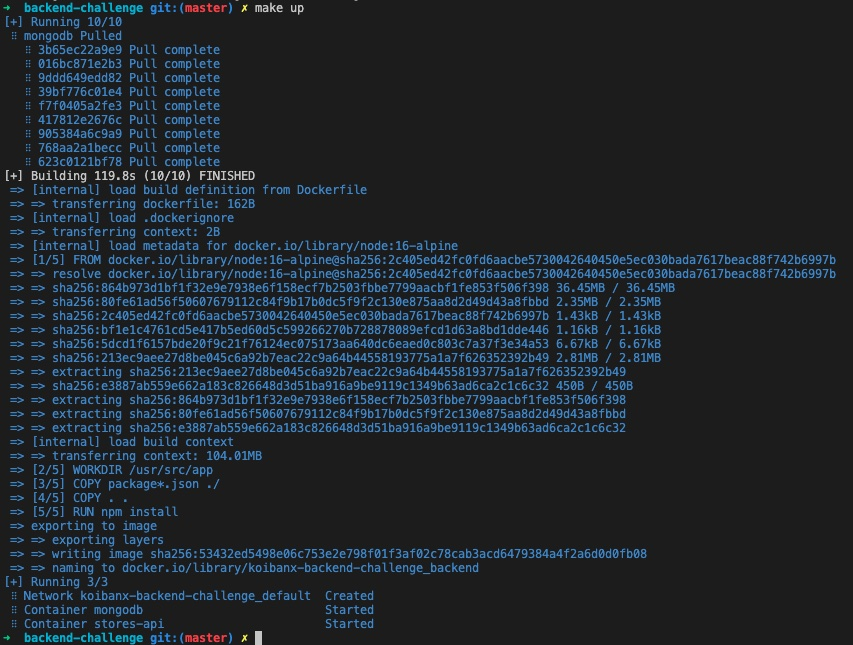   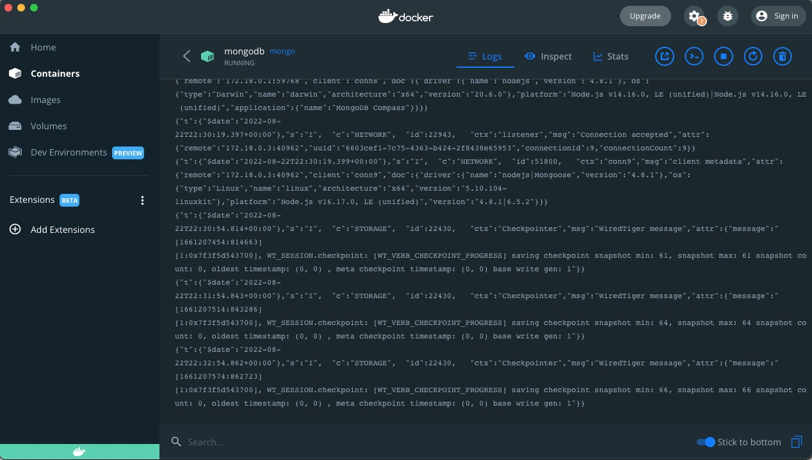
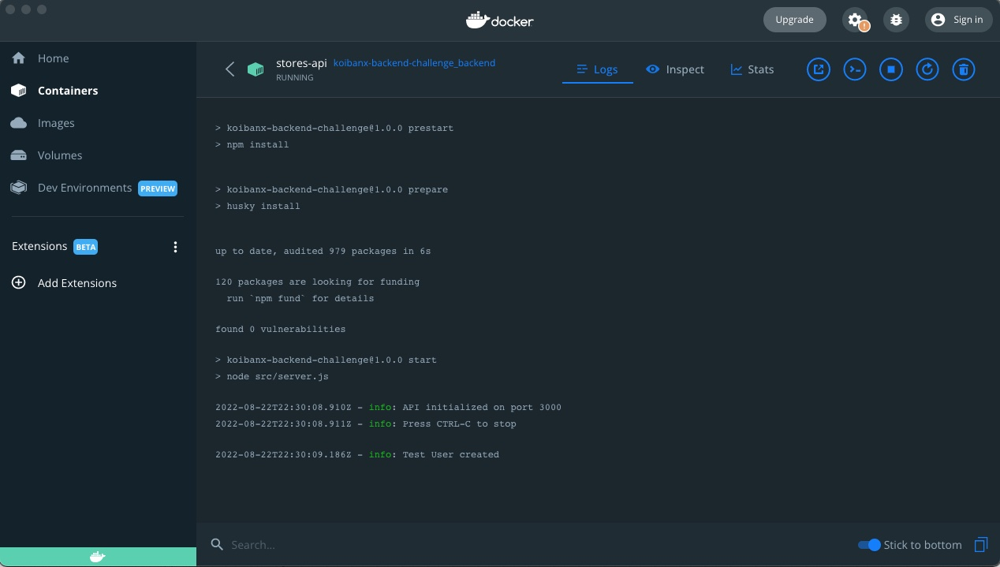   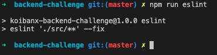
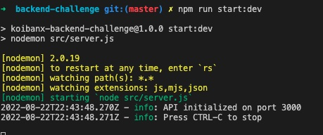   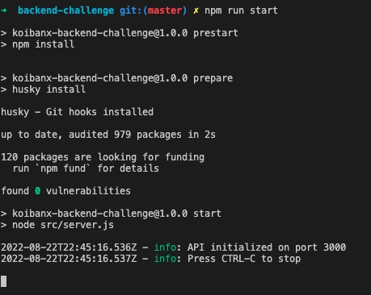
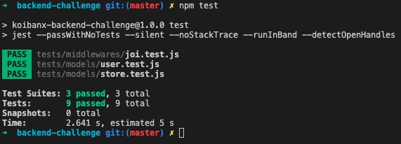   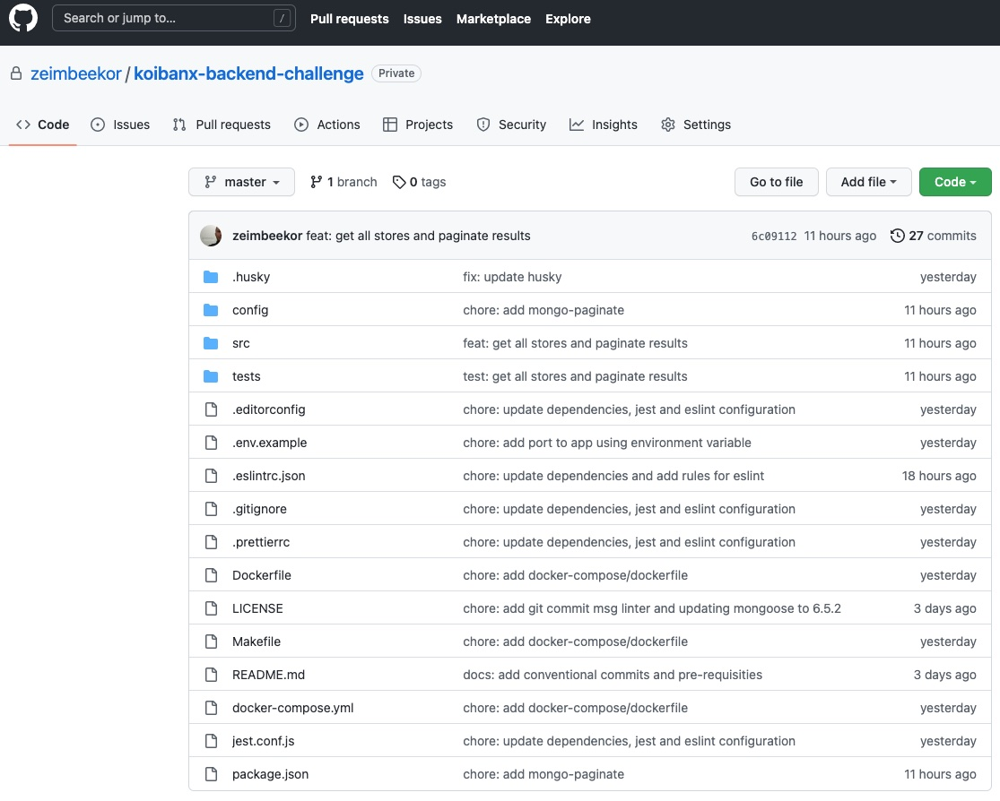

## Contributing

* [Alvaro Vega Plata](https://github.com/zeimbeekor)

## License

Check the [LICENSE](LICENSE) file for details
